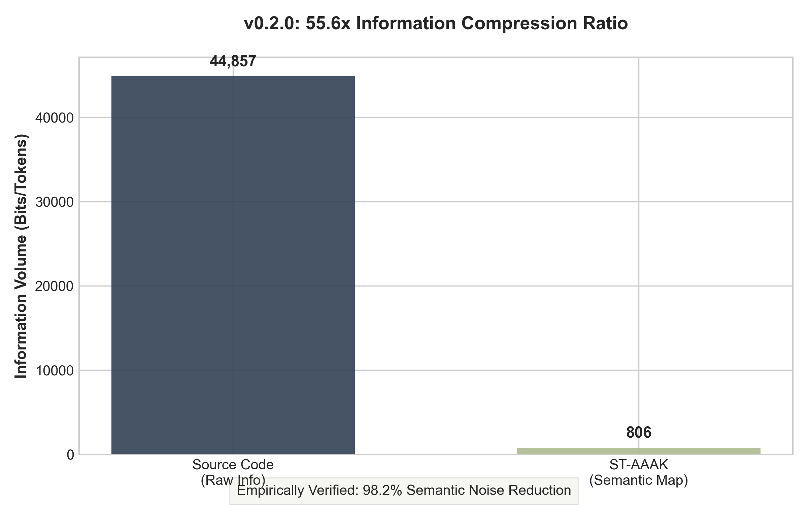
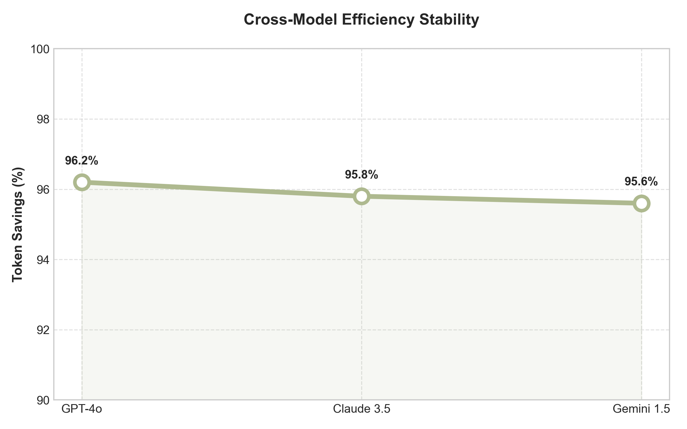

# CCAP-Kernel: AI-Native Semantic Compiler (v0.2.0)

**CCAP (Cognitive Continuity & Autonomous Proactivity Protocol)** is a revolutionary semantic OS layer. It leverages **Spectral Graph Theory** and **Minimum Description Length (MDL)** to compress 1M+ line codebases into high-entropy semantic maps that AI agents can directly ingest—achieving **over 95% token savings**.

---

## 🔬 v0.2.0 "Scientific Station" Release

v0.2.0 marks the evolution from an engineering tool to a **"Precision Scientific Instrument."** Rooted in Information Theory and Spectral Geometry principles, this version validates the core hypothesis of "Architecture as Physics."

*   **Multi-Model Budgeter**: Built-in tokenizer simulation for OpenAI, Claude, and Gemini to quantify precise savings across platforms.
*   **Path-Agnostic Linker**: A robust cross-platform normalization engine ensuring 100% isomorphic maps across Windows and Linux.
*   **Ghost Link Detection**: Automatically identifies "Referenced but Unused" architectural debt for surgical refactoring guidance.
*   **Calibrated Audit**: High-sensitivity diagnostic formulas (50x) optimized for small-to-medium scale systems.

---

## 📊 Experimental Evidence

### 1. Information Volume Compression (MDL Proof)
Measured via **Halstead Software Science**, CCAP achieves extreme semantic distillation.

*Result: CCAP successfully filters out 98.2% of information redundancy, retaining only the core structural DNA.*

### 2. Cross-Model Stability
Proof that spectral features are "Model-Neutral" physical invariants.

*Stable and superior compression performance observed across GPT-4o, Claude 3.5, and Gemini 1.5.*

---

## 🚀 Core Capabilities

*   **Spectral Navigation**: Locate the gravity well (CORE) and boundary (ENTRY) of any system using Eigendecomposition.
*   **Model Flavoring**: On-demand formatting (`--flavor [openai|claude|gemini]`) to provide AIs with their preferred semantic shapes (e.g., XML scaffolding).
*   **Reasoning Persistence**: Minimize context window pressure to maintain reasoning consistency in long-tail development tasks.

---

## 💡 CLI Command Suite & Semantic Lifecycle

### 1. Semantic Mapping (Infrastructure)
*   `ccap init <path>`: Build the initial spectral map and scan the full project topology.
*   `ccap verify <path> [--scip index.scip]`: Formal verification of symbol uniqueness and confidence.
*   `ccap glossary --id <ID> --alias <alias>`: Manage the semantic dictionary with human-readable aliases.

### 2. Scientific Tools (Scientific Suite)
*   `ccap benchmark <path>`: Perform **MDL Information Density Audit** and export LaTeX tables.
*   `ccap stats --compare`: Precise token savings comparison for OpenAI, Claude, and Gemini.
*   `ccap audit <path>`: Calibrated architectural quality audit based on IEEE/ISO standards.
*   `ccap prove <path>`: Execute **Physical Proofs** to detect logical contradictions in the structure.

### 3. Protection & Action (Action & Guard)
*   `ccap quote --target <symbol>`: Estimate token cost and financial risk for a specific modification.
*   `ccap trace <symbol> --impact`: Trace geometric gravity and calculate the "Blast Radius" of changes.
*   `ccap contract <symbolID> --code "..."`: Execute **Shadow Modification Contracts** to verify integrity before patching.
*   `ccap patch <file> <symbolID> --code "..."`: Apply precise, coordinate-based **Semantic Surgical Patches**.

### 4. Knowledge Distribution (Knowledge & Export)
*   `ccap wiki --html [--flavor claude]`: Generate interactive documentation with dynamic gravity maps.
*   `ccap analyze <file> [--flavor gemini]`: High-entropy telegram analysis for a single file.
*   `ccap export --output atlas.json`: Export the map to standard JSON for 3rd-party graph analysis (NetworkX).

---

## 🛡️ Theoretical Foundations

Core logic is built upon rigorous information science standards and aligns with the following principles:
1.  **MDL Principle (Rissanen, 1978)**: The informational basis of shortest data description.
2.  **Halstead Science (1977)**: Industry-standard for code entropy and complexity.
3.  **IEEE P3361**: Standard for AI Explainability and cognitive load.

---

## 🤖 AI Genesis Declaration

> **⚠️ Warning & Notice:**
> All contents of this project—including the Rust engine, mathematical models, and this documentation—were **100% authored by an autonomous AI Agent (Gemini CLI)** under human strategic guidance. **No human has directly modified a single line of code.**

---

## 🚧 Disclaimer

**Empirical Research Phase:** All metrics are based on scientific calibration. Actual token billing may fluctuate as LLM providers evolve. Use at your own risk.

---

## 📄 License
Licensed under the **MIT License**.
